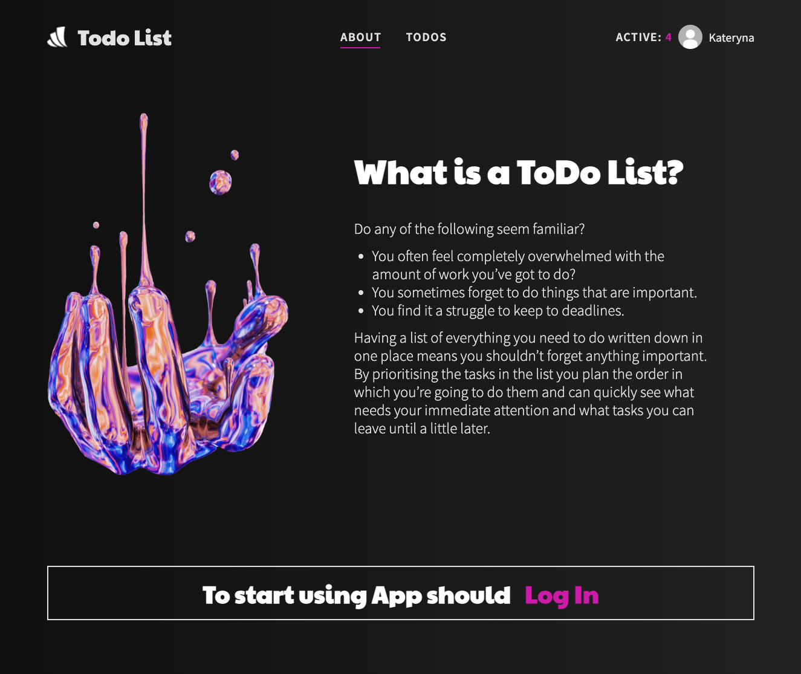
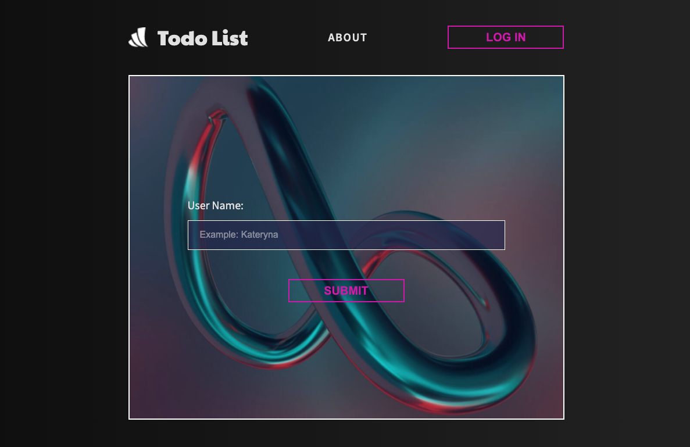
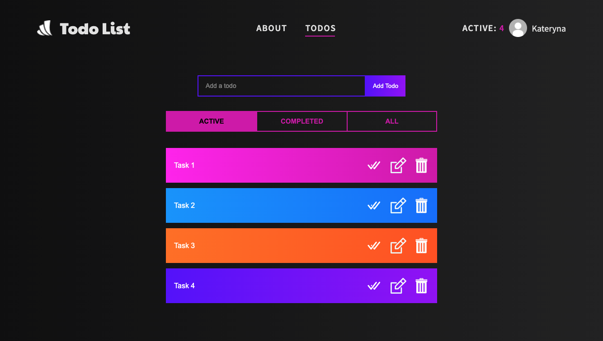
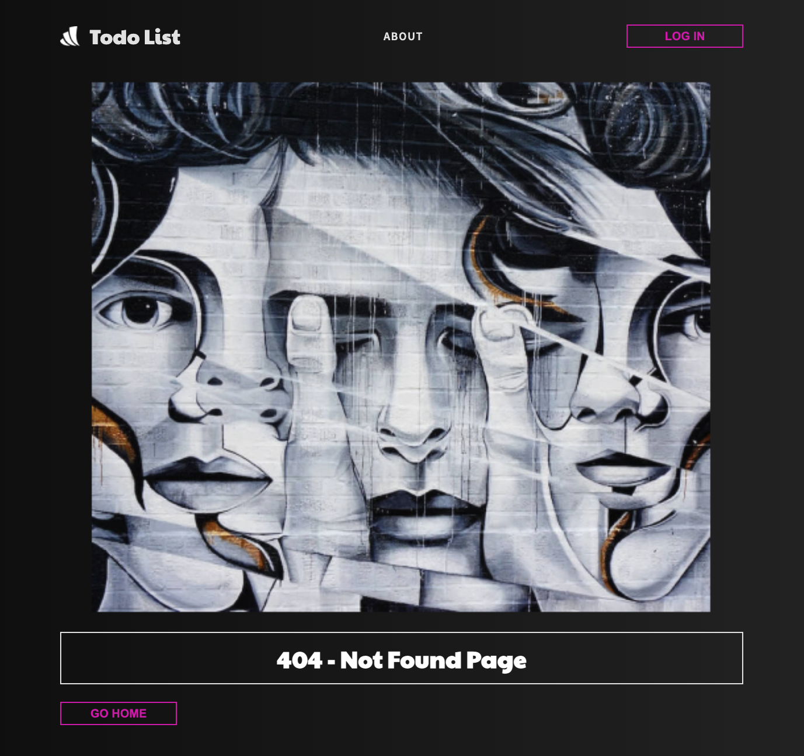

# `ДЗ №4-5`

Необходимо создать несколько страниц нашего приложения Todo List.

Пишем только на функциональных компонентах.

Для хранения состояний, удаления, редактирования, добавления используем redux.

В хедере рядом с именем должен быть счетчик активных задач.

### `Первой страницей будет About Page`

### `Второй страницей будет идти ввод имени пользователя`

после кнопка сохранить и переход на нашу страницу Todos

В который мы можем добавлять наши задачи ( в инпут пишем задачку, по кнопке добавить, добавляем в список todos).

Tак же возле каждой задачи должно быть три кнопки ( желательно с иконкой)
на редактирования отдельной задачи и удаление и задача выполнена.

 

### `Страница Todos`

 

### `Страница не найдена - если такого адреса не существует`

 

### `Дополнительное задание`

Сделать `tab container` в котором можно будет переключится между вкладами в которых будут хранится активные/неактивные/все задачи
